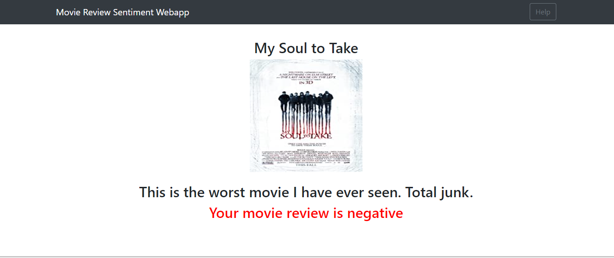

<h2>About the Dataset</h2>

The problem is a classification task in which we are supposed to label each review as negative sentiment or positive sentiment.The dataset is taken from Kaggle.Its a IMDB movie review dataset.

<h2>Description</h2>

Here we have used pretrained Glove Embeddings with which we need not to train word embeddings from scratch. It is built in Keras framework using various NLP techniques for preprocessing. Similarly we have used LSTM layers such that there will not be any vanishing gradient problem.
This project is also deployed with Flask in the form of Webapp i.e the user can select movie and the write the desired movie review and after clicking on predict button it gives the result wheather the movie review is positive or not.

<h2>Results</h2>

The model is able to sucessfully classify reviews as postive or negative.

